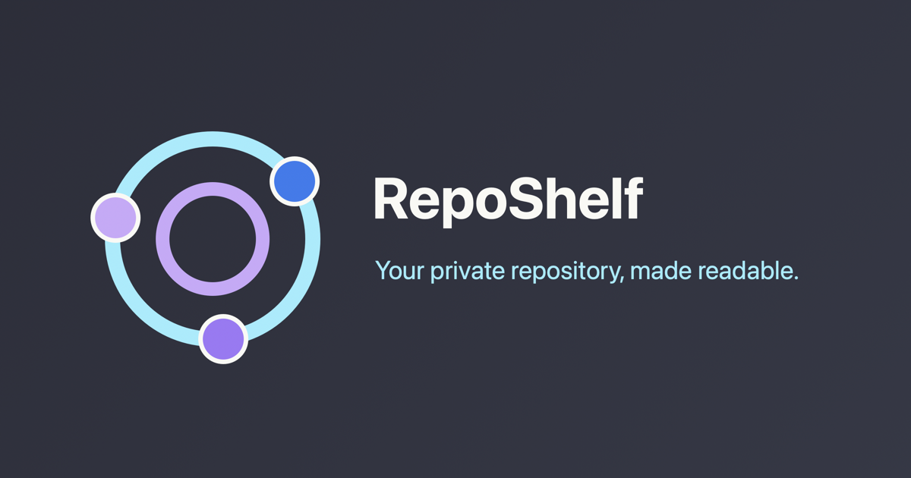
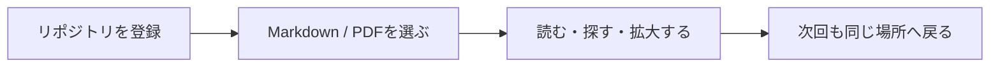

<div align="center">



# RepoShelf

### プライベートリポジトリを、読みやすい文書棚へ。

<p>
  GitHubに眠っているMarkdownとPDFを、検索できて、読みやすくて、また戻ってこられる場所にまとめる。
  <br />
  RepoShelfは、開発チームのためのプライベートドキュメントビューアーです。
</p>

<p>
  <a href="#はじめる"><strong>今すぐはじめる</strong></a>
  ·
  <a href="#できること">できること</a>
  ·
  <a href="#開発">開発</a>
</p>

[](https://react.dev/)
[](https://www.typescriptlang.org/)
[](LICENSE)

</div>

<br />

<table>
  <tr>
    <td width="33%" align="center">
      <strong>読む</strong>
      <br />
      MarkdownとPDFを同じ画面で表示
    </td>
    <td width="33%" align="center">
      <strong>探す</strong>
      <br />
      ファイル名、パス、本文をすばやく検索
    </td>
    <td width="33%" align="center">
      <strong>戻る</strong>
      <br />
      最後に読んだ場所へ自然に復帰
    </td>
  </tr>
</table>

## なぜ RepoShelf か

プロダクト仕様、運用手順、調査メモ、議事録、設計資料。
大事な文書ほど、プライベートリポジトリの中に散らばりがちです。

GitHubは保管場所としては強い一方で、読むための体験はどうしてもコードレビュー寄りになります。
RepoShelfは、そのギャップを埋めます。
リポジトリはそのままに、文書だけを「読む」「探す」「また開く」ための静かな棚として扱えます。

<br />

<table>
  <tr>
    <td width="100%" valign="top">
      <h3>きっかけは、スマホで文書を開いたときの小さな不便でした。</h3>
      <p>
        GitHub上のREADMEは便利ですが、ランディングページのように豊かな見た目や導線を作るには限界があります。
        さらにモバイルでは、プライベートリポジトリ内のPDFをその場で快適に読めない場面もあります。
      </p>
      <p>
        せっかくMarkdownやPDFとして整理した文書があるのに、読む体験が環境に左右される。
        RepoShelfは、そのもどかしさから生まれた「プライベート文書のための閲覧面」です。
      </p>
    </td>
  </tr>
</table>

<br />

<table>
  <tr>
    <td width="50%" valign="top">
      <h3>リポジトリは、知識の置き場所。</h3>
      <p>
        でも、毎回GitHubを開いてディレクトリをたどるのは少し重い。
        RepoShelfなら、よく使うプライベートリポジトリを登録して、MarkdownとPDFを文書ビューアーとして閲覧できます。
      </p>
    </td>
    <td width="50%" valign="top">
      <h3>READMEの先に、読む体験を。</h3>
      <p>
        コード、数式、タスクリスト、PDF。
        開発チームの文書に必要な表現を、ブラウザ上で読みやすく整えます。
      </p>
    </td>
  </tr>
</table>

## できること

<table>
  <tr>
    <td width="48%" valign="top">
      <h3>📚 文書棚として登録</h3>
      <p>
        複数のプライベートリポジトリを保存し、必要な文書へすぐ戻れます。
        プロジェクトごとのナレッジベース、社内ドキュメント、個人メモの閲覧に向いています。
      </p>
    </td>
    <td width="4%"></td>
    <td width="48%" valign="top">
      <h3>🔎 近くにある検索</h3>
      <p>
        ファイル名、パス、Markdown本文、現在開いているファイルの中身を検索できます。
        読んでいる流れを止めずに、必要な情報へ移動できます。
      </p>
    </td>
  </tr>
  <tr>
    <td width="48%" valign="top">
      <h3>📝 Markdownを美しく表示</h3>
      <p>
        コードハイライト、数式、タスクリストに対応。
        技術文書や設計メモを、READMEよりも落ち着いた表示で読めます。
      </p>
    </td>
    <td width="4%"></td>
    <td width="48%" valign="top">
      <h3>📄 PDFも同じ場所で</h3>
      <p>
        PDFを連続ページで表示し、ズームしながら確認できます。
        仕様書、提案資料、議事録PDFも文書棚の一部として扱えます。
      </p>
    </td>
  </tr>
  <tr>
    <td width="48%" valign="top">
      <h3>🌗 読む環境を切り替え</h3>
      <p>
        ライトテーマとダークテーマを切り替え可能。
        長時間読むときも、作業環境に合わせて目に馴染む表示を選べます。
      </p>
    </td>
    <td width="4%"></td>
    <td width="48%" valign="top">
      <h3>🔐 手元で扱う接続情報</h3>
      <p>
        接続先とトークンはブラウザのローカルストレージに保存されます。
        小さく始められて、個人や少人数チームの利用に向いています。
      </p>
    </td>
  </tr>
</table>

## こんなチームに

<table>
  <tr>
    <td width="25%" valign="top">
      <strong>立ち上げ期のプロダクトチーム</strong>
      <br />
      仕様や意思決定ログを、GitHubのまま読みやすくしたい。
    </td>
    <td width="25%" valign="top">
      <strong>技術文書が増えてきた開発組織</strong>
      <br />
      MarkdownとPDFが混ざった文書を、ひとつの入口から探したい。
    </td>
    <td width="25%" valign="top">
      <strong>個人開発者・研究者</strong>
      <br />
      private repoに蓄積したメモや資料を、読書ビューとして開きたい。
    </td>
    <td width="25%" valign="top">
      <strong>ナレッジを外に出せない現場</strong>
      <br />
      公開サービスに預けず、手元のブラウザで文書を扱いたい。
    </td>
  </tr>
</table>

## 使い方の流れ



## はじめる

```bash
npm install
npm run dev
```

1. `owner/repo` と Personal Access Token を入力します。
2. MarkdownまたはPDFを選びます。
3. 検索、テーマ切り替え、PDFズームを使いながら読み進めます。

> Personal Access Tokenはブラウザのローカルストレージに保存されます。共有端末では、使用後に接続先を削除してください。

## 開発

```bash
npm run typecheck
npm run test:run
npm run build
```

主な技術スタックは、React、TypeScript、Vite、TanStack Query、Markdown-It、KaTeX、PDF.jsです。

<br />

<div align="center">

### RepoShelf

#### あなたのプライベートリポジトリを、毎日ひらきたくなる文書棚に。

</div>
